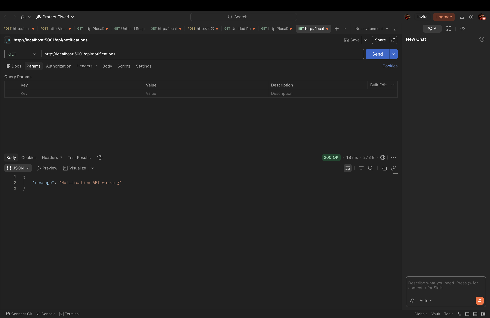
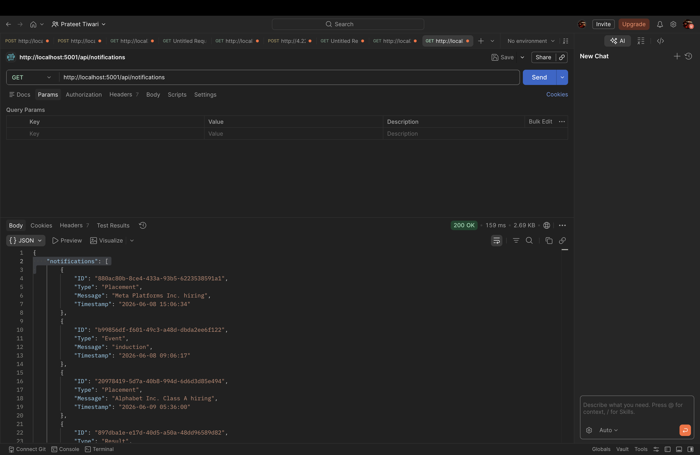

# Notification Scheduler Backend

Backend service built with Node.js and Express that fetches notifications from the Evaluation API, prioritizes them, simulates delivery, and logs application events.





## Tech Stack

- Node.js
- Express.js
- Axios
- Dotenv

## Setup

Install dependencies:

```bash
npm install
```

Create a `.env` file:

```env
ACCESS_TOKEN=your_access_token
PORT=5001
NODE_ENV=development
```

Run the application:

```bash
npm run dev
```

## API

### Get Notifications

```http
GET /api/notifications
```

## Priority Rules

| Type | Priority |
|--------|----------|
| Placement | 3 |
| Result | 2 |
| Event | 1 |

Notifications are processed in descending priority order.

## Features

- Fetch notifications from Evaluation API
- Priority-based scheduling
- Notification delivery simulation
- Logging middleware integration
- Error handling
